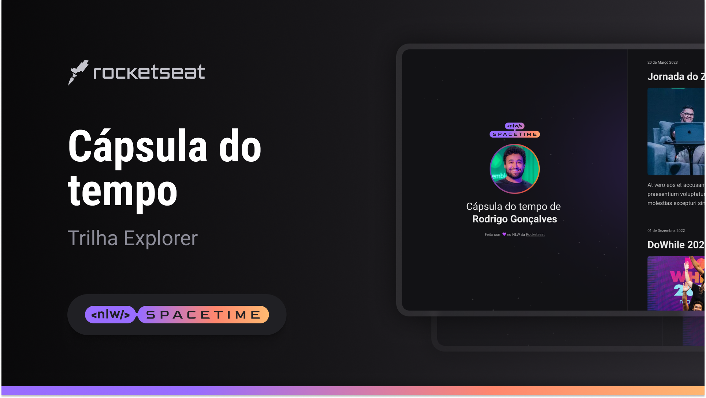

## 💻 projeto
Esse é um projeto responsivo de uma cápsula do tempo para exibir memórias em uma linha do tempo

## 🚀 Tecnologias
Esse projeto foi desenvolvido durante o NLW da Rocketseat com as seguintes tecnologias:

- HTML
- CSS
- Git e Gitbub

## 🏷️ layout
Você pode visualizar o layout do projeto através
[desse link] (https://www.figma.com/file/x826C5PgAr57Kxz2BQiku9/C%C3%A1psula-do-tempo-%E2%80%A2-Trilha-Explorer-(Community)?type=design&node-id=306%3A84&t=mN5NJpl5bX0JUHry-1)
É necessário ter uma conta no [Figma] (https://www.figma.com)